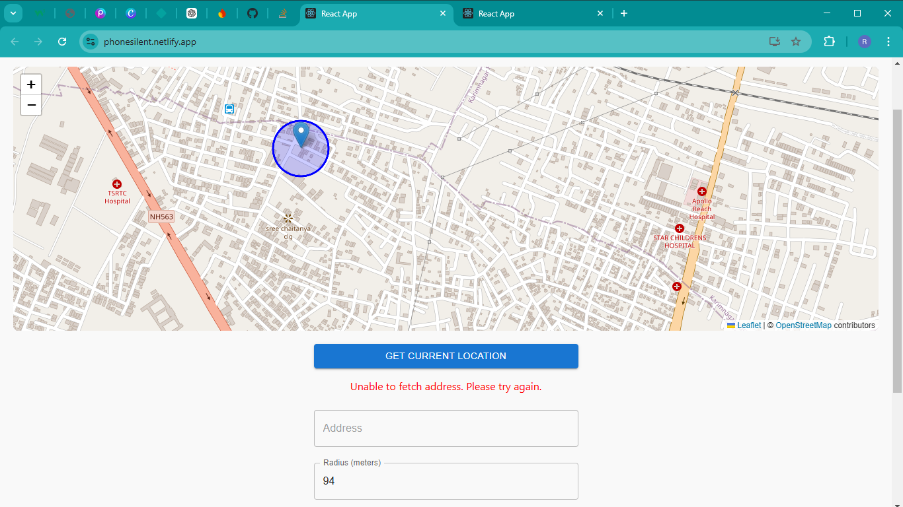
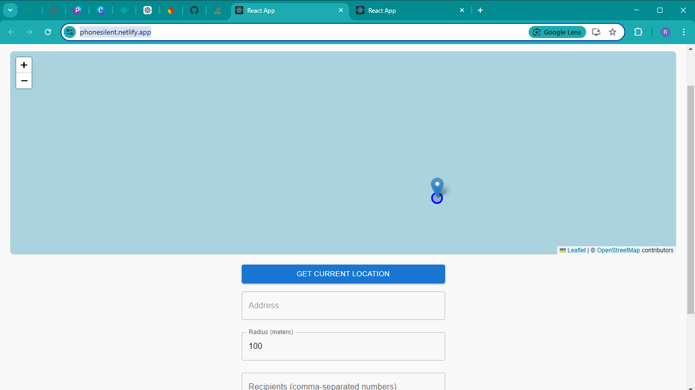

# 📍 Location-Based Auto Actions App

### 🔥 Automate Phone Modes & Messaging Based on Location

Welcome to the **Location-Based Auto Actions App** – a smart Android solution that automatically toggles phone modes (Silent/General) and sends custom SMS notifications when entering or leaving specified locations. 🚀

---

## 🌟 Features

✅ **Auto-Switch Phone Mode**: Automatically switch to silent mode when entering a geofenced area and revert to general mode when leaving.  
✅ **Custom SMS Notifications**: Send personalized messages to selected contacts when you reach a specific location.  
✅ **Dynamic Radius Selection**: Easily adjust the geofence radius for each location.  
✅ **Multiple Location Support**: Add, edit, and manage multiple saved locations.  
✅ **Live Map Integration**: Visual representation of geofenced areas with an interactive map.  
✅ **Persistent Data**: All locations are stored locally for future reference.  

---

## 📱 Tech Stack

- **Frontend**: React (with Leaflet.js for mapping)
- **Backend**: None (Client-side local storage used for persistence)
- **APIs**: OpenCageData for geocoding

---

## 🚀 Getting Started

### 1️⃣ Clone the Repository
```bash
 git clone https://github.com/YOUR_GITHUB_USERNAME/location-auto-actions.git
 cd location-auto-actions
```

### 2️⃣ Install Dependencies
```bash
npm install
```

### 3️⃣ Run the App
```bash
npm start
```

---

## ⚡ How It Works

1️⃣ **Get Current Location**: Fetches and displays the user's current GPS coordinates.  
2️⃣ **Set a Geofence**: Define a location with a custom radius and preferences.  
3️⃣ **Enable Silent Mode**: Phone will auto-switch to silent mode inside the set radius.  
4️⃣ **Send Custom Messages**: Notify contacts when entering a saved location.  
5️⃣ **View & Manage Locations**: Easily edit or remove locations from the list.  

---

## 🗺️ Screenshots

# 📍 Location-Based Auto Actions App

### 🔥 Automate Phone Modes & Messaging Based on Location

Welcome to the **Location-Based Auto Actions App** – a smart Android solution that automatically toggles phone modes (Silent/General) and sends custom SMS notifications when entering or leaving specified locations. 🚀

---

## 🌟 Features

✅ **Auto-Switch Phone Mode**: Automatically switch to silent mode when entering a geofenced area and revert to general mode when leaving.  
✅ **Custom SMS Notifications**: Send personalized messages to selected contacts when you reach a specific location.  
✅ **Dynamic Radius Selection**: Easily adjust the geofence radius for each location.  
✅ **Multiple Location Support**: Add, edit, and manage multiple saved locations.  
✅ **Live Map Integration**: Visual representation of geofenced areas with an interactive map.  
✅ **Persistent Data**: All locations are stored locally for future reference.  

---

## 📱 Tech Stack

- **Frontend**: React (with Leaflet.js for mapping)
- **Backend**: None (Client-side local storage used for persistence)
- **APIs**: OpenCageData for geocoding

---

## 🚀 Getting Started

### 1️⃣ Clone the Repository
```bash
 git clone https://github.com/YOUR_GITHUB_USERNAME/location-auto-actions.git
 cd location-auto-actions
```

### 2️⃣ Install Dependencies
```bash
npm install
```

### 3️⃣ Run the App
```bash
npm start
```

---

## ⚡ How It Works

1️⃣ **Get Current Location**: Fetches and displays the user's current GPS coordinates.  
2️⃣ **Set a Geofence**: Define a location with a custom radius and preferences.  
3️⃣ **Enable Silent Mode**: Phone will auto-switch to silent mode inside the set radius.  
4️⃣ **Send Custom Messages**: Notify contacts when entering a saved location.  
5️⃣ **View & Manage Locations**: Easily edit or remove locations from the list.  

---

## 🗺️ Screenshots

_Add screenshots of your app here to make it visually appealing._


---

## 🛠️ Future Enhancements

🔹 iOS Support 🚀  
🔹 Cloud-Based Storage & Sync 📡  
🔹 More Automation Rules 🛠️  

---

## 📜 License

**All rights reserved** © Shilpapavan 2025. This project is not open-source and cannot be copied or redistributed without permission.

---

### 🎯 Contribute & Support

For feature requests or bug reports, open an issue or reach out to me. Stay tuned for updates! 🌍

🚀 Happy Coding! 🔥


## 🛠️ Future Enhancements

🔹 iOS Support 🚀  
🔹 Cloud-Based Storage & Sync 📡  
🔹 More Automation Rules 🛠️  

---

### 🎯 Contribute & Support

For feature requests or bug reports, open an issue or reach out to me. Stay tuned for updates! 🌍

🚀 Happy Coding! 🔥

from nani
    dedicated to ammu💖